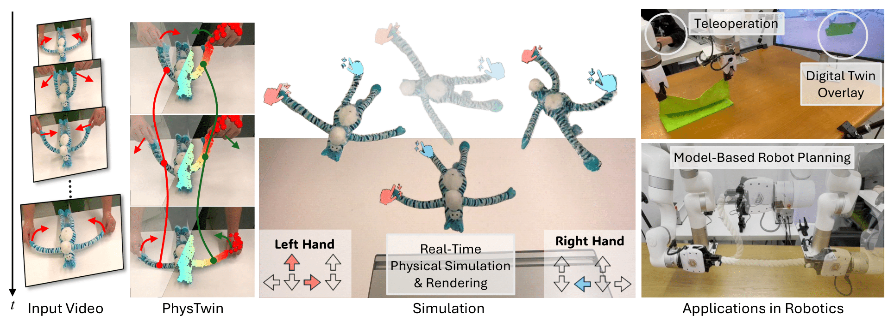

# PhysTwin: Physics-Informed Reconstruction and Simulation of Deformable Objects from Videos

<span class="author-block">
<a target="_blank" href="https://jianghanxiao.github.io/">Hanxiao Jiang</a><sup>1,2</sup>,
</span>
<span class="author-block">
<a target="_blank" href="https://haoyuhsu.github.io/">Hao-Yu Hsu</a><sup>2</sup>,
</span>
<span class="author-block">
<a target="_blank" href="https://kywind.github.io/">Kaifeng Zhang</a><sup>1</sup>,
</span>
<span class="author-block">
<a target="_blank" href="https://www.linkedin.com/in/hnyu/">Hsin-Ni Yu</a><sup>2</sup>,
</span>
<span class="author-block">
<a target="_blank" href="https://shenlong.web.illinois.edu/">Shenlong Wang</a><sup>2</sup>,
</span>
<span class="author-block">
<a target="_blank" href="https://yunzhuli.github.io/">Yunzhu Li</a><sup>1</sup>
</span>

<span class="author-block"><sup>1</sup>Columbia University,</span>
<span class="author-block"><sup>2</sup>University of Illinois Urbana-Champaign</span>

### [Website](https://jianghanxiao.github.io/phystwin-web/) | [Paper](https://jianghanxiao.github.io/phystwin-web/phystwin.pdf) | [Arxiv](https://arxiv.org/abs/2503.17973)

### Overview
This repository contains the official implementation of the **PhysTwin** framework.




### Update
**This repository will be actively maintained by the authors, with continuous updates introducing new features to inspire further research.**

- **[25.4.3] Multiple Objects Demos:** Showthe experimental features for handling collisions among multiple PhysTwins we construct. (See below for detailed instructions)
<p align="center">
  
  
</p>

- **[25.4.3] LBS GPU Memory Fix:** Clear intermediate variables to significantly reduce GPU memory usage in the interactive playground. The sloth case now requires only about 4GB in total. (Pull the latest code to apply the fix.)

- **[25.4.1] Force Visualization:** Visualize the forces applied to objects after optimization, aiding in force analysis from videos. (See below for detailed instructions)
<p align="center">
  
  
  
</p>

#### Upcoming Releases (Next Few Days)
- **Material Visualization:** Visualize object materials post-optimization to facilitate material analysis from interactions.
- **Material Transfer:** Provide a demo for transferring material properties from one PhysTwin to another object.
- **Rigid Object Demo:** Demonstrate our framework on rigid object interactions, showcasing its capability for rigid object tracking from videos.

#### Long-Term Plans
- **Batch Inferencing Support:** Integrate batch inferencing into the underlying SpringMass code, enabling faster rollouts and efficient data generation.


### Setup
```
# Here we use cuda-12.1
export PATH={YOUR_DIR}/cuda/cuda-12.1/bin:$PATH
export LD_LIBRARY_PATH={YOUR_DIR}/cuda/cuda-12.1/lib64:$LD_LIBRARY_PATH
# Create conda environment
conda create -y -n phystwin python=3.10
conda activate phystwin

# Install the packages
# If you only want to explore the interactive playground, you can skip installing Trellis, Grounding-SAM-2, RealSense, and SDXL.
bash ./env_install/env_install.sh

# Download the necessary pretrained models for data processing
bash ./env_install/download_pretrained_models.sh
```
Thanks to @GuangyanCai contributions, now we also have a windows setup codebase in `windows_setup` branch.

### Download the PhysTwin Data
Download the original data, processed data, and results into the project's root folder. (The following sections will explain how to process the raw observations and obtain the training results.)
- [data](https://drive.google.com/file/d/1A6X7X6yZFYJ8oo6Bd5LLn-RldeCKJw5Z/view?usp=sharing): this includes the original data for different cases and the processed data for quick run. The different case_name can be found under `different_types` folder.
- [experiments_optimization](https://drive.google.com/file/d/1xKlk3WumFp1Qz31NB4DQxos8jMD_pBAt/view?usp=sharing): results of our first-stage zero-order optimization.
- [experiments](https://drive.google.com/file/d/1hCGzdGlzL4qvZV3GzOCGiaVBshDgFKjq/view?usp=sharing): results of our second-order optimization.
- [gaussian_output](https://drive.google.com/file/d/12EoxhEhE90NMAqLlQoj_zM_C63BOftNW/view?usp=sharing): results of our static gaussian appearance.

### Play with the Interactive Playground
Use the previously constructed PhysTwin to explore the interactive playground. Users can interact with the pre-built PhysTwin using keyboard. The next section will provide a detailed guide on how to construct the PhysTwin from the original data.


Run the interactive playground with our different cases (Need to wait some time for the first usage of interactive playground; Can achieve about 30 FPS using RTX 4090)

```
python interactive_playground.py \
(--inv_ctrl) \
--n_ctrl_parts [1 or 2] \
--case_name [case_name]

# Examples of usage:
python interactive_playground.py --n_ctrl_parts 2 --case_name double_stretch_sloth
python interactive_playground.py --inv_ctrl --n_ctrl_parts 2 --case_name double_lift_cloth_3
```

Options: 
-   --inv_ctrl: inverse the control direction
-   --n_ctrol_parts: number of control panel (single: 1, double: 2) 
-   --case_name: case name of the PhysTwin case

### Train the PhysTwin with the data
Use the processed data to train the PhysTwin. Instructions on how to get above `experiments_optimization`, `experiments` and `gaussian_output` (Can adjust the code below to only train on several cases). After this step, you get the PhysTwin that can be used in the interactive playground.
```
# Zero-order Optimization
python script_optimize.py

# First-order Optimization
python script_train.py

# Inference with the constructed models
python script_inference.py

# Trian the Gaussian with the first-frame data
bash gs_run.sh
```

### Evaluate the performance of the contructed PhysTwin
To evaluate the performance of the construected PhysTwin, need to render the images in the original viewpoint (similar logic to interactive playground)
```
# Use LBS to render the dynamic videos (The final videos in ./gaussian_output_dynamic folder)
bash gs_run_simulate.sh
python export_render_eval_data.py
python visualize_render_results.py

# Get the quantative results
bash evaluate.sh
```

### Data Processing from Raw Videos
The original data in each case only includes `color`, `depth`, `calibrate.pkl`, `metadata.json`. All other data are processed as below to get, including the projection, tracking and shape priors.
```
# Process the data
python script_process_data.py

# Further get the data for first-frame Gaussian
python export_gaussian_data.py

# Get human mask data for visualization and rendering evaluation
python export_video_human_mask.py
```

### Control Force Visualization
Visualize the force applied by the hand to the object as inferred from our PhysTwin model, based solely on video data.
```
python visualize_force.py \
--n_ctrl_parts [1 or 2] \
--case_name [case_name]

# Examples of usage:
python visualize_force.py --case_name single_push_rope_1 --n_ctrl_parts 1 
python visualize_force.py --case_name single_clift_cloth_1 --n_ctrl_parts 1    
python visualize_force.py --case_name double_stretch_sloth 
```
The visualziation video is saved under `experiments` folder.

### Multiple Objects Demos
Try the experimental features for handling collisions among the multiple PhysTwins we construct.

```
# The stuff is deployed in the 'claw_matchine' branch
git pull
git checkout claw_machine

# Play with the examples
python interactive_playground.py --n_ctrl_parts 1 --case_name single_push_rope_1 --n_dup 4
python interactive_playground.py --n_ctrl_parts 2 --case_name double_stretch_sloth --n_dup 2
```

### Follow-up and Potential Collaborations  
If you are interested in collaborating or extending this work for your research, feel free to contact us at `hanxiao.jiang@columbia.edu`.  

### Citation
If you find this repo useful for your research, please consider citing the paper
```
@article{jiang2025phystwin,
    title={PhysTwin: Physics-Informed Reconstruction and Simulation of Deformable Objects from Videos},
    author={Jiang, Hanxiao and Hsu, Hao-Yu and Zhang, Kaifeng and Yu, Hsin-Ni and Wang, Shenlong and Li, Yunzhu},
    journal={arXiv preprint arXiv:2503.17973},
    year={2025}
}
```
